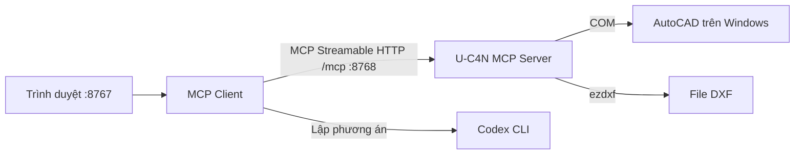

# U-C4N MCP Server và MCP Client qua HTTP

Dự án gồm hai ứng dụng độc lập, mỗi ứng dụng có source, môi trường Python, dependency, dữ liệu và lệnh chạy riêng. Client giao tiếp với server bằng **MCP Streamable HTTP**.



## Cấu trúc

Server và client nằm ở hai thư mục riêng, đặt cạnh nhau trong workspace:

```text
MCP Research/
├─ UC4NAutoCADMCP/          Server, tiện ích và tests
│  ├─ mcp_server/          Host HTTP, engine, source U-C4N và dữ liệu CAD
│  ├─ scripts/             Lệnh tiện ích chạy/dừng/setup một hoặc cả hai phần
│  ├─ tests/               Kiểm tra server và client qua HTTP
│  └─ pyproject.toml       Cấu hình pytest/ruff
├─ UC4NAutoCADMCPClient/   Client độc lập
   ├─ client/              Web UI, MCP HTTP client, AI planner, đọc tài liệu
   ├─ .venv/               Môi trường riêng cho client
   ├─ requirements*.txt    Dependency và bản chốt của client
   ├─ scripts/             setup.ps1, start.ps1, stop.ps1, check_*.py
   ├─ examples/            Tài liệu yêu cầu mẫu
   └─ data/                Token, tài liệu upload, log client
```

Source [U-C4N/Autocad-MCP](https://github.com/U-C4N/Autocad-MCP) chốt ở **1.6.0**, commit `cdb10638963898b3ea9b10cdd96a2c9bc495f184`, license MIT. Xem `upstream-source.json`. Source gốc là clone riêng, được Git workspace bỏ qua; setup tải lại đúng commit nếu thiếu.

## Cài đặt

PowerShell tại folder `UC4NAutoCADMCP` (client cần nằm cạnh folder này):

```powershell
powershell.exe -NoProfile -ExecutionPolicy Bypass -File scripts/setup.ps1
```

Lệnh setup tạo môi trường riêng trong `mcp_server/.venv` và `../UC4NAutoCADMCPClient/.venv`. Có thể truyền `-Python 'duong-dan/python.exe'`; máy hiện tại dùng Python 3.14. Client không cần source U-C4N hoặc thư viện ezdxf để chạy.

## Chạy riêng từng phần

```powershell
# MCP server: COM điều khiển AutoCAD, endpoint http://127.0.0.1:8768/mcp
powershell.exe -NoProfile -ExecutionPolicy Bypass -File mcp_server/scripts/start.ps1 -Backend com -Background

# MCP client: giao diện http://127.0.0.1:8767
powershell.exe -NoProfile -ExecutionPolicy Bypass -File ../UC4NAutoCADMCPClient/scripts/start.ps1 -Background
```

Để dùng DXF độc lập, khởi động server với `-Backend ezdxf`. Engine thuộc cấu hình server; client chỉ chọn endpoint HTTP, không đổi engine hoặc khởi động server. Bỏ `-Background` để chạy foreground và xem log trực tiếp.

Tiện ích chạy cả hai:

```powershell
powershell.exe -NoProfile -ExecutionPolicy Bypass -File scripts/start-background.ps1 -Backend com
```

Có thể dùng `-Component server` hoặc `-Component client` để chạy riêng. Cổng tùy chỉnh: server `-Port`, client `-Port`; tiện ích chung dùng `-ServerPort` và `-Port`. Nhập lại endpoint trong giao diện khi đổi cổng server.

## Dừng

```powershell
# Dừng cả hai, giữ AutoCAD mở
powershell.exe -NoProfile -ExecutionPolicy Bypass -File scripts/stop.ps1

# Hoặc chỉ dừng một phần
powershell.exe -NoProfile -ExecutionPolicy Bypass -File scripts/stop.ps1 -Component client
powershell.exe -NoProfile -ExecutionPolicy Bypass -File scripts/stop.ps1 -Component server
```

Đóng/dừng client chỉ ngắt phiên HTTP, server tiếp tục chạy. Khi server dừng hoặc mất kết nối, client đánh dấu phiên mất hiệu lực; khởi động server lại rồi bấm **Kết nối MCP** và lập phương án mới.

## Sử dụng client

1. Mở `http://127.0.0.1:8767`.
2. Nhập token từ **`../UC4NAutoCADMCPClient/data/operator-token.txt`**. Dữ liệu và token của client nằm trong folder client riêng.
3. Nhập endpoint `http://127.0.0.1:8768/mcp`, bấm **Kết nối MCP**. Client lấy trạng thái, catalog và schema trực tiếp từ server qua HTTP.
4. Nhập prompt hoặc chọn tài liệu yêu cầu. Chọn các tool cấp cho AI rồi bấm **Lập phương án**.
5. Xem các bước và tham số, chọn đúng DWG trong AutoCAD, xác nhận rồi thực thi. Có thể xem schema và lập phương án gọi tool thủ công.

Token client bảo vệ REST API của web app; không gửi cho AI hay MCP server. Nếu server đặt biến môi trường `MCP_AUTH_TOKEN` trước khi chạy, nhập token đó vào ô **Bearer token MCP**. Token MCP chỉ gửi trong Authorization header tới endpoint bạn chọn, không lưu trong trình duyệt. Mặc định cả hai ứng dụng bind loopback, server có thể chạy không có Bearer token trên máy local.

## Nhập tài liệu thay cho prompt

Chọn file tại **Tài liệu yêu cầu**, xem phần **Nội dung đã đọc từ tài liệu**, để trống prompt nếu muốn, rồi bấm **Lập phương án từ file**. Ghi chú bổ sung là tùy chọn.

| Định dạng | Nội dung AI nhận |
| --- | --- |
| TXT, MD, JSON, CSV | Toàn bộ chữ UTF-8, tối đa 200.000 ký tự |
| DOCX | Chữ và ô bảng của nội dung chính; chưa đọc ảnh, header/footer, đối tượng nhúng |
| XLSX | Tên sheet và giá trị ô; công thức giữ dạng chữ, chưa đọc ảnh/biểu đồ |
| PDF | Chữ và ảnh mọi trang, kể cả scan; tối đa 12 trang |
| PNG, JPG, WEBP | Ảnh tĩnh, cần model đọc được ảnh |

Tối đa 20 MB/file. Excel tối đa 10.000 hàng, 100 cột/sheet và 50.000 ô trong các hàng được đọc. Preview hiển thị 4.000 ký tự đầu; AI nhận nội dung trích đầy đủ trong giới hạn. Trang PDF render với cạnh dài tối đa 2.000 pixel. File quá giới hạn hoặc hỏng báo lỗi thay vì tự cắt nội dung. `.doc`/`.xls` cần đổi sang `.docx`/`.xlsx`.

File upload nằm trong `../UC4NAutoCADMCPClient/data/drawings/imports/<id>/`, thuộc client và không truyền sang server CAD. AI nhận chữ/ảnh tài liệu khi bấm lập phương án. **Bỏ file** bỏ lựa chọn, không xóa file khỏi đĩa. Mẫu: `../UC4NAutoCADMCPClient/examples/requirements.md`.

## Hành vi và giới hạn

- Client không chạy MCP subprocess. HTTP là đường giao tiếp MCP duy nhất của client; server quản lý COM/ezdxf và thư mục được phép đọc/ghi.
- Server cho phép thao tác file trong `mcp_server/data/drawings/`. Có thể chạy `mcp_server/run.py --backend com --drawings-dir <folder>` để đổi thư mục. Đường dẫn trong tool là đường dẫn **trên máy server**.
- COM dùng DWG hiện hành; allowlist file không khóa document đang mở. Với phương án Coordinator có metadata hợp lệ, client đọc lại tên/đường dẫn, đơn vị và số đối tượng trước thực thi; khác biệt yêu cầu lập lại. Đây chưa phải khóa DWG hay phát hiện mọi sửa đổi hình học.
- Không giới hạn số bước/phương án. AI vẫn chịu timeout 150 giây, giới hạn output và hạn mức tài khoản. Coordinator tự chọn công cụ từ toàn bộ catalog MCP; tự đánh giá sau thực thi và trình phương án tiếp theo để duyệt. Lịch sử lưu tại `../UC4NAutoCADMCPClient/data/coordinator.sqlite3`; hiện tối đa 12 giai đoạn/công việc.
- Phương án chỉ chạy một lần, hết hạn sau 10 phút và gắn với phiên MCP. Kết nối lại yêu cầu lập phương án mới.
- Chạy tuần tự, dừng khi một bước lỗi; không tự retry hoặc rollback cả phương án. Lỗi mạng có thể có kết quả chưa xác định; đọc kết quả và kiểm tra bản vẽ trước khi thử lại.
- AI dùng Codex CLI đã đăng nhập, chỉ lập phương án. Không có biến tham chiếu kết quả bước trước. Nếu thiếu kích thước hoặc yêu cầu chưa rõ, AI đặt câu hỏi.
- Bộ chọn model/mức suy luận tải động từ Codex app-server và lưu mặc định tại `../UC4NAutoCADMCPClient/data/ai-settings.json`. Chế độ agent mặc định có theo dõi trạng thái; chế độ CLI tương thích vẫn khả dụng. Cấu hình AI được cố định theo công việc và ghi trong từng phương án.
- Server phục vụ một ngữ cảnh CAD chung. Các client HTTP kết nối cùng server dùng chung engine/document; dự án dành cho một người vận hành, chưa có khóa toàn phương án giữa nhiều client.
- 3D và chế độ bỏ kiểm tra command/LISP đều tắt. Đọc `system_capabilities` để biết khả năng thực tế của engine.

## Kiểm tra

Môi trường `.venv` ở root dùng cho development, không dùng để chạy hai dịch vụ:

```powershell
.venv/Scripts/python.exe -m pytest -q
../UC4NAutoCADMCPClient/.venv/Scripts/python.exe -m ruff check ../UC4NAutoCADMCPClient/client ../UC4NAutoCADMCPClient/scripts mcp_server/run.py tests
../UC4NAutoCADMCPClient/.venv/Scripts/python.exe ../UC4NAutoCADMCPClient/scripts/check_browser.py
```

Tests tự khởi động HTTP server ezdxf tạm, kiểm tra Bearer token, catalog, schema, 12 bước thực thi, tạo/lưu/đọc lại DXF, chống chạy lặp, đổi phiên, dừng sau lỗi, đóng client không dừng server và xử lý server mất kết nối. Tests file kiểm tra Word/Excel/PDF, ảnh và giới hạn upload.

`check_browser.py` cần hai dịch vụ đang chạy, kiểm tra kết nối HTTP, upload, duyệt và tool đọc thật bằng Edge. Các script `check_live.py`, `check_file_browser.py`, `check_pdf_file.py` trong `../UC4NAutoCADMCPClient/scripts/` có thể gọi Codex thật và dùng hạn mức AI.

Nguồn kỹ thuật: [FastMCP HTTP transport](https://gofastmcp.com/clients/transports), [HTTP deployment](https://gofastmcp.com/deployment/http), [OpenAI Docs — Codex CLI](https://learn.chatgpt.com/docs/developer-commands?surface=cli), [PyMuPDF](https://pymupdf.readthedocs.io/en/latest/recipes-images.html), [openpyxl](https://openpyxl.readthedocs.io/en/stable/optimized.html).
