# Kiến trúc base

## Quyết định: ứng dụng sở hữu trạng thái, agent chỉ phân tích

```mermaid
flowchart LR
    U[Text / transcript / attachment reference] --> A[Agent adapter: HTTP hoặc command]
    A --> J[DrawingProposal JSON v1]
    J --> V[Validate schema + provenance]
    V --> S[SQLite: request và revision]
    S --> P[Thông số + SVG + điểm cần duyệt]
    P --> H[Người vận hành xác nhận]
    H --> G[Approval gate: revision + digest + hạn dùng]
    G --> C[CAD adapter]
    C --> R[Đọc lại hình học và đối chiếu]
```

Agent không sở hữu hội thoại duy nhất của dự án: input, phương án, lịch sử sửa và xác nhận nằm trong SQLite của ứng dụng. Có thể đọc lại dữ liệu bằng API và chuyển cho agent khác. Mỗi request ghi `agent_id`; bản đầu chưa tự động chuyển tiếp hội thoại nhiều lượt hoặc fallback agent giữa chừng.

## Luồng trạng thái

`draft → approved → executing → completed`

- Sửa phương án ở draft/approved: tăng revision, trở về draft và xóa approval.
- Còn câu hỏi chưa giải quyết: không được approve.
- Approval gắn SHA-256 của toàn bộ proposal, target document và adapter; hết hạn sau 15 phút.
- Chỉ token người vận hành mới gọi được approve/execute. Lệnh agent không có API key này trong môi trường được truyền trực tiếp.
- `BEGIN IMMEDIATE` bảo vệ chuyển trạng thái trước khi gọi CAD, nên hai lần execute đồng thời không vẽ hai lần.
- Execute lại một job completed trả kết quả cũ.
- Lỗi/timeout sau khi bắt đầu thực thi đưa job về `needs_reconciliation`; không tự thử vẽ lại.
- Nếu process chết ở `executing`, giữ nguyên trạng thái để đối soát thủ công. Bản đầu chưa có công cụ đối soát/recovery tự động. Không tự đặt lại về approved.

SHA-256 giúp gắn xác nhận với nội dung, không phải chữ ký chống người có quyền sửa cơ sở dữ liệu. Token operator là quyền của tài khoản ứng dụng một người dùng, chưa thay thế đăng nhập và định danh người dùng đa tài khoản.

## Hình học và độ chính xác

Schema v1 chỉ hỗ trợ đường bao chữ nhật 2D song song trục WCS, đơn vị mm. Không coi đường bao là tường xây. Mỗi kích thước có giá trị, nguồn và chứng cứ. `geometry_meaning`, origin, layer và các giả định được hiển thị trong phương án.

Nguồn `user`, `image_annotation` là khai báo của agent cần người kiểm tra; `inferred`, `proposed` luôn xuất hiện thêm trong danh sách duyệt. Core không có thuật toán chứng minh OCR hoặc ước lượng ảnh là đúng.

Muốn thêm polyline, circle, cửa, dimension: mở rộng schema có version, compiler, preview, CAD adapter và conformance tests đồng thời. Không cho agent chèn AutoLISP, shell, Python hoặc lệnh CAD tùy ý vào proposal.

## Tình trạng AutoCAD đã kiểm tra

Ngày 2026-10-05: máy có AutoCAD 2027, COM `AutoCAD.Application.26`, bundle Autodesk AutoCAD MCP Server. Lần kiểm tra đầu chưa chạy AutoCAD; lúc 16:40 kiểm tra lại đã có process. Gắn vào phiên hiện có bằng `Marshal.GetActiveObject` thành công, đọc được version `26.0s (LMS Tech)`, Visible=true, Documents.Count=0. Chưa có bản vẽ để kiểm chứng đọc/ghi hình học. Không tự mở hoặc thay đổi bản vẽ.

Tài liệu Autodesk hiện chỉ định Autodesk Assistant là client được hỗ trợ; AutoCAD có công cụ đọc/phân tích, Civil 3D có thêm công cụ sửa. **Không coi plugin được cài là bằng chứng có API vẽ cho ứng dụng ngoài.** Lựa chọn dự kiến để vẽ thật là adapter COM hoặc plugin .NET; cần thử trên máy trước khi quyết định. Có thể bọc adapter đã xác minh thành MCP riêng ở giai đoạn tiếp theo.

## Origin

- Yêu cầu người dùng trong phiên 2026-10-05: tạo AI_AutoCad, xác nhận trước khi vẽ, thay agent phân tích được.
- Quan sát registry Windows, `acad.exe`, `PackageContents.xml` và danh sách tiến trình.
- [Autodesk AutoCAD and Civil 3D MCP Server](https://help.autodesk.com/view/ADSKMCP/ENU/?guid=ADSKMCP_AutoCADCivil3DMcp_autodesk_autocad_civil_3d_mcp_html), đọc 2026-10-05.
- [FastAPI testing](https://fastapi.tiangolo.com/tutorial/testing/).
- [Pydantic strict mode](https://docs.pydantic.dev/latest/concepts/strict_mode/).
